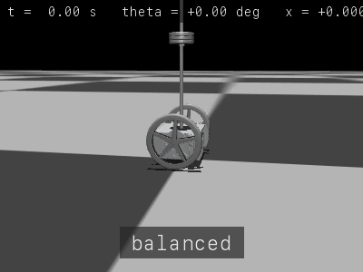
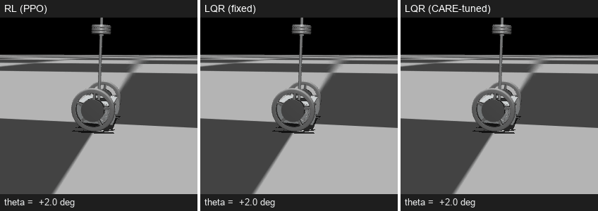
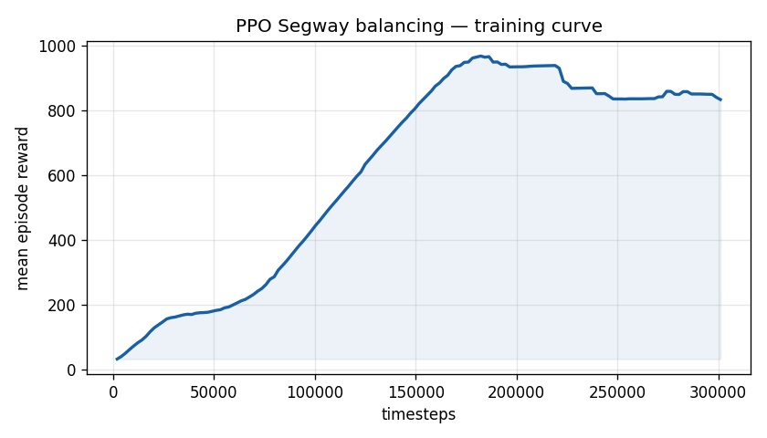
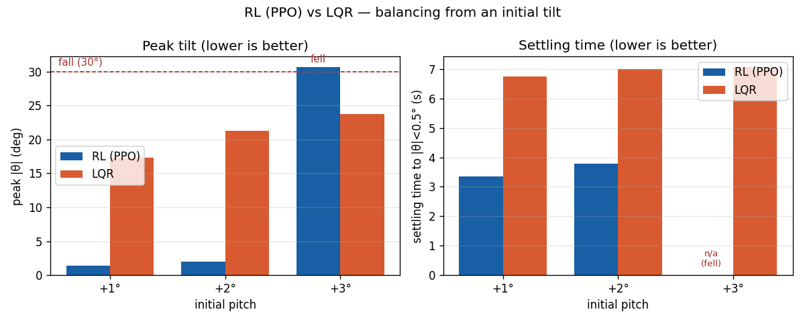
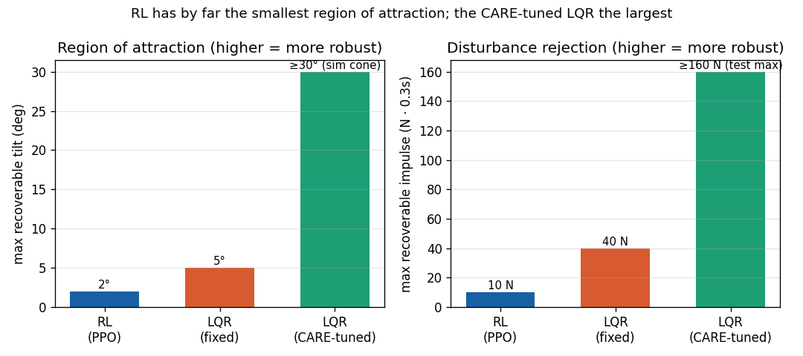
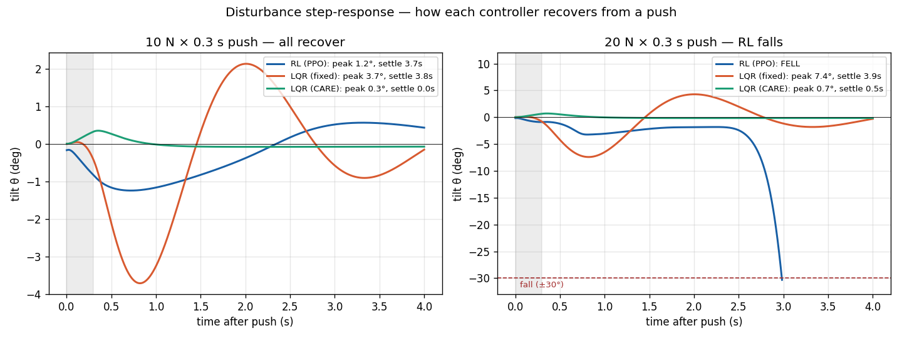

# rosclaw-mujoco

> ROS2 Segway Balancing Simulator with NLP-based Natural Language Control

[](https://github.com/Odung-sol/rosclaw-mujoco/actions/workflows/ci.yml)

A two-wheeled inverted pendulum (Segway) balanced by an LQR controller in MuJoCo, with a Gemini-powered NLP pipeline that converts natural language commands into robot control signals over ROS2.

<p align="center">
  
</p>

<p align="center">
  <em>Three escalating pushes, three recoveries. The LQR controller catches the segway after each kick.</em>
</p>

> **Implementer's guide:** [`docs/ARCHITECTURE.md`](docs/ARCHITECTURE.md) is the
> full topic catalogue, component map, and control / NL / disturbance flow
> diagrams. [`CLAUDE.md`](CLAUDE.md) lists the load-bearing invariants you
> shouldn't break. [`docs/SECURITY.md`](docs/SECURITY.md) covers the threat
> model and key-rotation runbook.

## Architecture

```
┌──────────────────────────────────────────────────────────────┐
│  User                                                        │
│  "move forward 1.5 meters smoothly" / "reduce vibration"    │
└──────────────┬──────────────────────┬────────────────────────┘
               │ CLI (nlp_cli_node)   │ OpenClaw (extensions/)
               ▼                      ▼
┌──────────────────────────────────────────────────────────────┐
│  Docker Container (ROS2 Humble / linux/arm64)                │
│                                                              │
│  ┌─────────────────────────┐   ┌───────────────────────────┐ │
│  │  Gemini NLP Node        │   │  rosbridge_websocket :9090│ │
│  │  /segway/nlp_input ──►  │   └────────┬──────────────────┘ │
│  │  Gemini API ──► JSON    │            │ DDS                │
│  │  ──► /segway/cmd_reference           │                    │
│  └──────────┬──────────────┘            │                    │
│             │                           │                    │
│  ┌──────────▼──────────────┐  ┌────────▼──────────────────┐ │
│  │  LQR Controller Node   │  │  ROSClaw Discovery Node   │ │
│  │  - LQR gain scheduling │  │  - capability report      │ │
│  │  - on-the-fly tuning   │  │  - auto-discovery         │ │
│  │  - CARE solver + rollback  └───────────────────────────┘ │
│  └──────────┬──────────────┘                                 │
└─────────────┼────────────────────────────────────────────────┘
              │ WebSocket (/segway/cmd_torque)
┌─────────────▼────────────────────────────────────────────────┐
│  macOS Native                                                │
│  ┌─────────────────┐    ┌──────────────────────┐             │
│  │ segway_bridge.py │◄──►│  MuJoCo Simulator   │             │
│  │ (WS client)      │    │  segway_sim.py      │             │
│  └─────────────────┘    │  + STL meshes        │             │
│                          └──────────────────────┘             │
└──────────────────────────────────────────────────────────────┘
```

## How It Works

This project demonstrates an LLM acting as a **high-level planner** for a real-time control system:

1. **Natural Language Input** — The user issues commands in plain language via terminal or chatbot.
2. **Intent Parsing (Gemini NLP Node)** — A ROS2-native node calls the Gemini API to parse the user's intent into a structured JSON control command.
3. **ROS2 Middleware** — The parsed command is published to `/segway/cmd_reference` over DDS, staying entirely within the local ROS2 graph.
4. **LQR Gain Scheduling** — The `lqr_controller_node` updates target states or re-tunes Q/R weights on the fly.
5. **MuJoCo Simulation** — Computed wheel torques are sent to the physics engine via the WebSocket bridge, and the Segway reacts in real time.

## Features

- **LQR Balancing** — Optimal control based on a linearized inverted pendulum model (CARE solver with hard-coded MATLAB K fallback)
- **Position Regulation** — The controller returns the segway to its starting position after a disturbance, not just upright
- **RL (PPO) Controller** — A Stable-Baselines3 PPO policy balances the same model, trained against the same physics and state pipeline as the LQR for a fair head-to-head. Drop-in via `segway_sim.py --rl`; see [`rl/README.md`](rl/README.md)
- **External Disturbance API** — `SegwaySimulation.apply_disturbance(force_N, duration_s)` injects an impulse at the body's top point; or push the same payload over the `/segway/disturbance` ROS2 topic. Acceptance bound: 1 N × 0.3 s recovers to within 0.5° / 0.1 m in 2 s
- **Gemini NLP Node** — Natural language to JSON command conversion via `google-genai`, with rate limiting and schema validation. **Not in the control loop** — runs at intent-translation latency
- **MuJoCo Physics** — Full rigid-body simulation with real STL meshes (linux/arm64 Docker, macOS-native MuJoCo viewer)
- **ROSClaw + OpenClaw** — AI agent interface for natural language control (move, stop, tune gains, etc.)
- **CI/CD Pipeline** — GitHub Actions: ruff lint + **100 unit tests** (RL env/training tests skip on CI without gymnasium/torch) + TypeScript typecheck + Docker arm64 build (Buildx GHA-cached)
- **WebSocket Bridge** — Stable macOS-to-Docker ROS2 communication, dual-connection (publish + subscribe) for race-free advertise / subscribe

## Project Structure

```
rosclaw-mujoco/
├── docker-compose.yml               # ROS2 stack (4 services)
├── docker/
│   └── Dockerfile.ros2              # ros:humble + rosbridge + pinned pip deps
│
├── docs/
│   ├── ARCHITECTURE.md              # Full topic catalogue + flow diagrams
│   ├── SECURITY.md                  # Threat model + key rotation runbook
│   └── demo.gif                     # README banner
│
├── mujoco_sim/                      # MuJoCo simulation (macOS native)
│   ├── segway_sim.py                # Main simulator with viewer + apply_disturbance API
│   ├── segway.xml                   # MJCF model definition
│   ├── lqr_controller.py            # Standalone LQR controller
│   ├── state_extractor.py           # Quaternion-based state extraction
│   ├── segway_bridge.py             # ROS2 WebSocket bridge client (dual connection)
│   ├── render_demo_gif.py           # Offscreen rendering for demo GIF
│   ├── plot_client.py               # Real-time plotting
│   └── meshes/                      # STL mesh files
│
├── rl/                              # RL (PPO) controller (macOS native)
│   ├── segway_env.py                # Gymnasium env wrapping SegwaySimulation
│   ├── reward.py                    # 4-term balancing reward (+ alive bonus)
│   ├── metrics.py                   # per-episode comparison metrics
│   ├── train.py                     # PPO training + training-curve plot
│   ├── evaluate.py                  # RL vs LQR comparison + phi_dot check
│   ├── policy_adapter.py            # run a trained policy behind the LQR interface
│   ├── README.md                    # train / eval / --rl usage
│   └── models/                      # trained artifacts (gitignored)
│
├── ros2_ws/src/segway_controller/   # ROS2 nodes
│   ├── lqr_controller_node.py       # LQR control node (CARE + MATLAB fallback)
│   ├── gemini_nlp_node.py           # Gemini NLP parsing node
│   ├── nlp_cli_node.py              # Terminal input publisher
│   ├── discovery_node.py            # ROSClaw auto-discovery
│   └── params.yaml                  # Physical params + LQR weights
│
├── tests/                           # pytest suite (100 total; RL tests skip on CI)
│   ├── conftest.py                  # ROS2/Gemini mock fixtures
│   ├── test_gemini_nlp_node.py      # NLP node tests (21)
│   ├── test_lqr_controller_node.py  # LQR node tests (17)
│   ├── test_disturbance_recovery.py # Disturbance API + acceptance (6)
│   ├── test_bridge_disturbance.py   # Bridge JSON validation (18)
│   ├── test_reward.py               # RL reward, pure NumPy (9)
│   ├── test_metrics.py              # RL episode metrics, pure NumPy (7)
│   ├── test_segway_env.py           # RL env + controller seam + phi_dot (17)
│   └── test_rl_policy_adapter.py    # RL policy adapter (5)
│
├── extensions/openclaw-plugin/      # OpenClaw plugin (TypeScript)
│   └── src/index.ts                 # 7 tools (move, stop, tune, etc.)
│
├── packages/rosbridge-client/       # rosbridge WebSocket client lib
│   └── src/index.ts
│
├── requirements.txt                 # macOS sim deps (pinned ==)
├── requirements-dev.txt             # pytest + ruff (pinned ==)
├── requirements-ros2.txt            # Docker runtime deps (pinned ==)
├── requirements-rl.txt              # RL deps: gymnasium/SB3/torch (pinned ==)
├── .env.example                     # Canonical env-var list
└── CLAUDE.md                        # Load-bearing invariants for AI agents
```

## Installation

### Prerequisites (macOS)

```bash
# Python 3.10–3.12 (scipy doesn't ship wheels for 3.13+ yet, so 3.14 will fail
# at install time). Pinned in pyproject.toml; verify with `python3 --version`.
brew install python@3.11        # or python@3.10 / python@3.12

# Recommended: a project-local venv so MuJoCo + scipy live next to the repo.
python3.11 -m venv .venv
.venv/bin/pip install -r requirements.txt -r requirements-dev.txt

# Docker Desktop (Apple Silicon)
# https://www.docker.com/products/docker-desktop
```

### Docker ROS2 Stack

```bash
# Copy the env example and fill in your Gemini API key
cp .env.example .env
# Edit .env to set GOOGLE_API_KEY=<your key>

# First run (builds images, takes 3–5 min on first arm64 build, < 1 min after)
docker compose up -d

# Verify all four services are up
docker compose ps
# Expected: segway_ros2 (healthy), segway_lqr, segway_discovery, segway_nlp
```

## Quick Start

### 1. Communication Test (no MuJoCo required)

```bash
python mujoco_sim/segway_bridge.py
```

Expected output:
```
[Bridge] Connected to ws://127.0.0.1:9090
[Bridge] Topics ready.
  step      theta          x       torque
------------------------------------------
     0     +0.0500    +0.0000    +0.0000
    50     +0.0215    +0.0001    -2.1453
  [OK] Balanced for 30s!
```

### 2. MuJoCo Simulation

```bash
python mujoco_sim/segway_sim.py
```

### 3. Monitor ROS2 Topics

```bash
docker exec segway_ros2 bash -c \
  "source /opt/ros/humble/setup.bash && ros2 topic list"
```

### 4. Natural Language Control (optional)

```bash
# Set your API key (get one at https://aistudio.google.com/app/apikey)
export GOOGLE_API_KEY="your-key-here"

# Restart the NLP container to pick up the key
docker compose up -d gemini_nlp

# Send commands via CLI
python ros2_ws/src/segway_controller/nlp_cli_node.py
# Type: "move forward 1 meter" → Gemini parses → LQR executes
```

### 5. OpenClaw Integration (optional)

```bash
brew install node
npm install -g pnpm
cd extensions/openclaw-plugin
pnpm install && pnpm build
```

## ROS2 Topics

| Topic | Direction | Hz | Description |
|---|---|---|---|
| `/segway/state` | MuJoCo → ROS2 | 100 | Robot state (theta, x, velocity) |
| `/segway/cmd_torque` | ROS2 → MuJoCo | 100 | Wheel torque commands |
| `/segway/cmd_reference` | NLP / OpenClaw → LQR | on-demand | JSON control commands |
| `/segway/disturbance` | Operator → MuJoCo | on-demand | External impulse for testing recovery |
| `/segway/nlp_input` | User → Gemini NLP | on-demand | Natural language text input |
| `/segway/controller/status` | ROS2 → All | 10 | Controller status |
| `/rosclaw/capabilities` | Discovery → All | 1 | Robot capability report |

All topics are `std_msgs/String` carrying UTF-8 JSON. See [`docs/ARCHITECTURE.md`](docs/ARCHITECTURE.md) §3 for full payload schemas.

### State Message Format

```json
{
  "timestamp": 1709500000.123,
  "theta": 0.015,
  "theta_dot": -0.003,
  "x": 0.5,
  "x_dot": 0.02,
  "wheel_angle": 12.5,
  "wheel_vel": 1.2
}
```

### Reference Commands

| Command | Parameters | Description |
|---------|-----------|-------------|
| `move_to` | `x` (m) | Move to target position |
| `set_velocity` | `velocity` (m/s) | Set target velocity |
| `enable` | — | Start the controller |
| `disable` | — | Emergency stop |
| `update_gains` | `Q_diag`, `R_val` | Update LQR weights |
| `reset` | — | Reset to initial state |

## NLP Command Examples

```
"move forward 1 meter"         → {"command": "set_velocity", "velocity": 0.5}
"go back slowly"               → {"command": "set_velocity", "velocity": -0.2}
"stop"                         → {"command": "set_velocity", "velocity": 0.0}
"start balancing"              → {"command": "enable"}
"emergency stop"               → {"command": "disable"}
```

## Disturbance Recovery

Push an impulse at the body's top point and watch the LQR recover.

### From a Python script (or test)

```python
sim = SegwaySimulation(use_ros2=False)
sim.reset(pitch_deg=0.0)
sim.apply_disturbance(force_N=1.0, duration_s=0.3)   # 1 N forward kick × 0.3 s
for _ in range(2500):
    sim.step()
# Expected: peak |theta| < 5 deg, |theta| < 0.5 deg at +2 s, x_drift < 0.1 m
```

### Over the ROS2 wire

```bash
docker compose exec ros2_bridge bash -c \
  'ros2 topic pub --once /segway/disturbance std_msgs/msg/String \
   "{data: \"{\\\"force\\\": 1.0, \\\"duration\\\": 0.3}\"}"'
```

The bridge's listener validates the payload (rejects NaN / Inf / non-positive duration) and forwards it into `apply_disturbance()` on the simulator.

The README demo GIF runs three escalating kicks (30 N → 50 N → −80 N) with the LQR active throughout — see `mujoco_sim/render_demo_gif.py` to reproduce.

## Reinforcement Learning (PPO) Controller

An alternative to the LQR: a PPO policy trained against the **same** MuJoCo physics and state pipeline, so it drops into the live sim and compares fairly. Runs entirely macOS-native (no Docker / ROS2). Full guide: [`rl/README.md`](rl/README.md).

<p align="center">
  
</p>
<p align="center">
  <em>Released from a +2° tilt (offscreen MuJoCo render): the <b>fixed-gain</b> LQR (middle, tuned for impulses) lurches past 20°, while the RL policy (left) and a properly-tuned <b>CARE</b> LQR (right) both stay upright — the overshoot is a tuning artifact, not an RL-vs-LQR gap.</em>
</p>

<p align="center">
  
</p>
<p align="center">
  <em>Training curve — mean episode reward climbs 33 → ~834 (peak ~968) over 300k steps as the policy learns to balance.</em>
</p>

<p align="center">
  
</p>
<p align="center">
  <em>Peak tilt (lower is better). A <b>CARE-tuned LQR matches RL</b> at +1–2° and stays stable at +3° where <b>RL tips over</b>; on the 1N impulse the LQR is best. The fixed gains overshoot everywhere — they target impulses, not initial tilts. Honest read: comparable in-distribution, with the tuned LQR more robust — not "RL beats LQR".</em>
</p>

<p align="center">
  
</p>
<p align="center">
  <em>Region of attraction — the largest disturbance each controller still recovers from. <b>RL has by far the smallest</b> (only a 2° tilt / 10 N push); the CARE-tuned LQR recovers from ≥30° / ≥160 N. "Maximum recoverable tilt" is a standard yardstick in the balancing-robot literature.</em>
</p>

**Objective metrics** (a +2° step, by what the self-balancing-robot literature reports — settling time, peak/overshoot, control effort, position drift, region of attraction, disturbance rejection). Reproduce with `python -m rl.benchmark`:

| controller | peak \|θ\| | settling | torque RMS | position drift | max tilt (RoA) | max impulse |
|---|---|---|---|---|---|---|
| RL (PPO) | 2.0° | 3.35 s | 0.92 | **0.04 m** | 2° | 10 N |
| LQR (fixed) | 23.1° | 7.10 s | 4.60 | 0.75 m | 5° | 40 N |
| **LQR (CARE-tuned)** | **2.0°** | **0.45 s** | **0.19** | 0.43 m | **≥30°** | **≥160 N** |

By these standard criteria the **CARE-tuned LQR is the stronger controller** — ~7× faster settling, ~5× less torque, and a far larger region of attraction. RL's only edge is tighter position-holding. "Looks stable in the GIF" is necessary but not sufficient; these are the numbers the field compares ([review](https://www.mdpi.com/2218-6581/14/8/101), [LQR/PID metrics](https://www.researchgate.net/publication/374164891_Performance_comparison_between_LQR_and_PID_controllers_for_two-wheeled_self-balancing_vehicle), [region-of-attraction](https://arxiv.org/pdf/2604.04455)).

<p align="center">
  
</p>
<p align="center">
  <em>The artifact control papers actually use — tilt θ(t) after a defined push (not a video). <b>Left (10 N, all recover):</b> the CARE LQR is critically damped (snaps back instantly), RL has a small peak but a slow tail (3.7 s), the fixed LQR rings (under-damped). <b>Right (20 N):</b> RL holds briefly then <b>falls</b>, while both LQRs recover. This answers "how much force → recovered in how many seconds", which a stable-looking GIF cannot.</em>
</p>

Figures regenerate with `python -m rl.plot_results` and the GIF with `python -m rl.render_gif`; the metrics table with `python -m rl.benchmark` (all reuse the training log + saved policy — no retrain).

```bash
pip install -r requirements-rl.txt                       # gymnasium, stable-baselines3, torch
python -m rl.train --timesteps 300000                    # trains -> rl/models/ + training_curve.png
python -m rl.evaluate --model rl/models/ppo_segway.zip   # RL vs LQR table + phi_dot check
python mujoco_sim/segway_sim.py --rl                     # drive the sim with the trained policy
```

The env reuses `SegwaySimulation`, observes `[θ, θ̇, φ, φ̇]` (same as the local LQR) and emits a per-wheel torque, with a 4-term quadratic reward (the discrete-time analogue of the LQR cost) plus an alive bonus.

**On a fair comparison, RL does not beat a properly-tuned LQR.** A CARE-tuned LQR (`rl/lqr_tuning.py`, using the ROS2 node's own `Q`/`R`) matches the RL policy in its training range (±1–2°), stays stable at +3° where **RL tips over**, and rejects the 1 N impulse better. The dramatic gap you'll see against the *fixed-gain* `SegwayLQR` is a tuning artifact — those MATLAB gains were tuned for impulse-from-upright, not step initial tilts, so they overshoot badly off-design. RL's genuine strength here is that it learned a low-overshoot in-distribution balancer from reward alone; its weakness is brittleness at the distribution edge. RL dependencies stay out of CI and Docker (`requirements-rl.txt` only).

## Testing

```bash
# Run unit tests (Gemini API is mocked — no billing)
pip install -r requirements-dev.txt
pytest tests/ -v

# Lint
ruff check .
```

CI runs automatically on every push and PR:
- **lint-and-test** — ruff + pytest (62 tests)
- **typescript** — `tsc --noEmit` matrix over `extensions/openclaw-plugin` and `packages/rosbridge-client`
- **docker-build** — linux/arm64 image build verification with Buildx GHA cache

## LQR Gain Tuning

```
state = [theta, theta_dot, x, x_dot]
u = -K @ state
```

| Weight | Effect |
|--------|--------|
| `Q[0]` (theta) ↑ | Faster uprighting |
| `Q[1]` (theta_dot) ↑ | Vibration damping |
| `Q[2]` (x) ↑ | Stronger position tracking |
| `Q[3]` (x_dot) ↑ | Velocity stability |
| `R` ↑ | Conservative control (smaller torques) |

## Troubleshooting

| Issue | Solution |
|---|---|
| `platform (linux/amd64) does not match` | Verify `platform: linux/arm64` in `docker-compose.yml` |
| `ros2: command not found` (macOS) | ROS2 runs inside Docker only |
| Topics not showing | Wait at least 2s after publisher connects |
| WebSocket drops | Check `ping_interval=10` setting |
| Segway falls over | Increase `Q_diag[0]` in `params.yaml` |
| Segway oscillates | Decrease `Q_diag`, increase `R_val` |

## References

- [ROSClaw](https://github.com/PlaiPin/rosclaw) — OpenClaw-ROS2 integration
- [ROS2 Humble](https://docs.ros.org/en/humble/)
- [rosbridge_suite](https://github.com/RobotWebTools/rosbridge_suite)
- [MuJoCo](https://mujoco.org/)
- [Google Gemini API](https://ai.google.dev/)

## License

Apache-2.0 — See [LICENSE](LICENSE)
